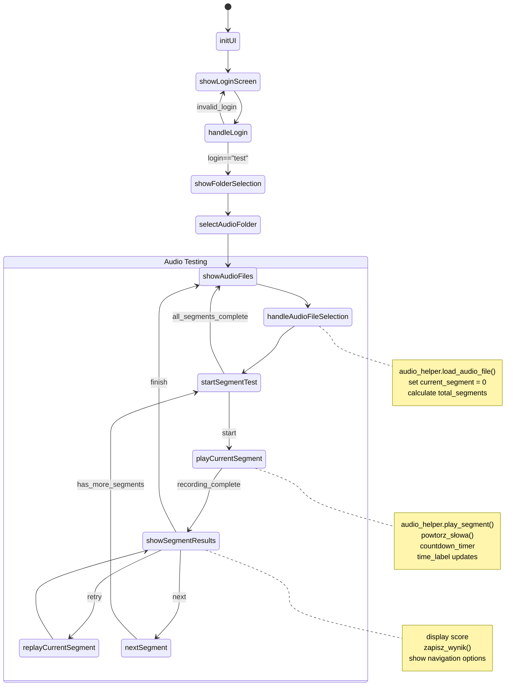

# Projekt UwuBiś

## 1. O projekcie

### Opis
> "słysząc jakiś ciąg słów (np. 5 słów z audiobooka), człowiek z implantem chce sprawdzić, czy wszystko poprawnie zrozumiał. Musi więc zapisać sobie słowa które usłyszał, a następnie porównać z faktycznymi słowami (np. sprawdzając w wersji papierowej książki) i zobaczyć ile słów zrozumiał poprawnie." lic. Przemysław Bańkowski. 

### Wymagania
- Python 3.11
- Biblioteki:
  - `speech_recognition` 3.11.0
  - `sounddevice` 72.1.0
  - `soundfile` 0.12.0
  - `numpy` 2.1.1
  - `pandas` 2.1.1
  - `openpyxl` 3.1.2

Instalacja bibliotek
```sh
pip install speechrecognition sounddevice soundfile numpy pandas openpyxl
```
## Tworzenie wirtualnego środowiska (opcjonalne)
[*DO ZROBIENIA*]

### ~Uruchamianie~
~~Umieść plik audio (np. audio1.wav) w katalogu audio~~

~~Uruchom skrypt~~:
```python
python main_new.py
```
### 0.1 Dokumentacja bibliotek
- [QTPY](https://doc.qt.io/qtforpython-6/overviews/timers.html)
## 0.2 Ogólne wytłumaczenie poszczególnych funkcji. 


### Importy
- `import os`, `import sys`, `import time`, `import threading`: Importowanie standardowych bibliotek Pythona.
- `import speech_recognition as sr`: Importowanie biblioteki do rozpoznawania mowy.
- `import logging`: Importowanie biblioteki do logowania.
- `from PySide6.QtWidgets import ...`: Importowanie komponentów GUI z PySide6.
- `from PySide6.QtCore import Qt, QTimer`: Importowanie dodatkowych komponentów z PySide6.
- `from library import zapisz_wynik, AUDIOLIB`: Importowanie funkcji i klas z pliku library.py.
- `from config import Config`: Importowanie klasy Config z pliku config.py.
- `import spacy`: Importowanie biblioteki spaCy.

### Inicjalizacja
- `nlp = spacy.load(...)`: Ładowanie modelu języka polskiego spaCy.
- `logging.basicConfig(...)`: Konfiguracja logowania.

### Klasa MainWindow
- `class MainWindow(QMainWindow)`: Klasa głównego okna aplikacji.
- `def __init__(self)`: Konstruktor klasy MainWindow.
- `def initUI(self)`: Funkcja inicjalizująca interfejs użytkownika.
- `def showLoginScreen(self)`: Funkcja wyświetlająca ekran logowania.
- `def handleLogin(self)`: Funkcja obsługująca logowanie użytkownika.
- `def showFolderSelection(self)`: Funkcja wyświetlająca ekran wyboru folderu.
- `def selectAudioFolder(self)`: Funkcja obsługująca wybór folderu z plikami audio.
- `def showAudioFiles(self)`: Funkcja wyświetlająca listę plików audio.
- `def handleAudioFileSelection(self)`: Funkcja obsługująca wybór pliku audio.
- `def startSegmentTest(self)`: Funkcja rozpoczynająca test segmentu.
- `def playCurrentSegment(self)`: Funkcja odtwarzająca bieżący segment.
- `def confirmRepetition(self)`: Funkcja potwierdzająca powtórzenie segmentu.
- `def showSegmentResults(self)`: Funkcja wyświetlająca wyniki segmentu.
- `def showReferenceWords(self)`: Funkcja wyświetlająca słowa referencyjne.
- `def replayCurrentSegment(self)`: Funkcja powtarzająca odtwarzanie bieżącego segmentu.
- `def nextSegment(self)`: Funkcja przechodząca do następnego segmentu.
- `def clearLayout(self)`: Funkcja czyszcząca układ GUI.

### 0.2.1 Schemat Działania funkcji main.py

## 2. Wytłumacznie właściwości kodu, co do czego i po co.
Tutaj tłumacze konkretne funcje bibliotek jak działają, a całe elementy kodu są wytłumaczone dokładniej w [WYTŁUMACZENIE](explaining.md)

### 2.1. `threading`
1. `threading` to standardowy moduł Pythona służący do obsługi wielowątkowości. Pozwala na:
- Równoległe wykonywanie zadań
- Zarządzanie wieloma operacjami jednocześnie
- Poprawę wydajności aplikacji, szczególnie przy operacjach I/O

Przykład użycia:
```python
import threading

def moje_zadanie():
    print("Wykonuję zadanie w osobnym wątku")

# Tworzenie nowego wątku
watek = threading.Thread(target=moje_zadanie)
watek.start()  # Uruchomienie wątku
watek.join()   # Oczekiwanie na zakończenie wątku
```
W kontekście aplikacji audio, threading jest szczególnie przydatny do:

- Odtwarzania dźwięku w tle
- Nagrywania audio bez blokowania interfejsu
- Przetwarzania dźwięku równolegle z innymi operacjami

**Obszerniejszy przykład**

```python
import threading
import time
from playsound import playsound  # dla przykładu

class AudioPlayer:
    def __init__(self):
        self.is_playing = False
        
    def play_audio_file(self, file_path):
        # Funkcja odtwarzająca dźwięk w osobnym wątku
        def play():
            self.is_playing = True
            playsound(file_path)
            self.is_playing = False
            
        # Utworzenie i uruchomienie wątku
        audio_thread = threading.Thread(target=play)
        audio_thread.start()

       
        
    def wait_for_completion(self):
        # Czekamy aż dźwięk się skończy
        while self.is_playing:
            time.sleep(0.1)

# Przykład użycia:
player = AudioPlayer()
player.play_audio_file("sample.mp3")  # Rozpoczyna odtwarzanie w tle
print("Możesz wykonywać inne operacje podczas odtwarzania!")
player.wait_for_completion()  # Poczekaj na zakończenie
```
Najbardziej przykuwa uwagę element 
```python
# Utworzenie i uruchomienie wątku
        audio_thread = threading.Thread(target=play)
        audio_thread.start()
```
Już tłumaczę co to robi i po co, dla wygody rozbiję to na części:
1. `threading.Thread(target=play)`:

- Tworzy nowy obiekt wątku
- `target=play` wskazuje funkcję `play` jako kod do wykonania w tym wątku
- `play` to funkcja zdefiniowana wcześniej (bez nawiasów, bo przekazujemy referencję)

2. `audio_thread.start()`:

- Uruchamia utworzony wątek
- Od tego momentu funkcja play wykonuje się równolegle z głównym programem
- Nie blokuje pozostałej części programu


# n. Posłowie 
Moja wizję rozwoju projektu opisałem w [dalszy rozwoj](dalszy_rozwoj.md). 

## Brudnopis Karol + krzys
AUDIOLIB Class:

`load_audio_file`: Ładuje plik audio i segmentuje go na segmenty po 5 słowach.
`play_segment`: Odtwarza bieżący segment audio.
_`play_segment_audio`: Wewnętrzna metoda do odtwarzania segmentu audio.
`_recognize_words`: Rozpoznaje słowa z pliku audio.
`replay_current_segment`: Powtarza odtwarzanie aktualnego segmentu.
`get_total_segments`: Zwraca całkowitą liczbę segmentów.
`get_current_segment_words`: Zwraca słowa z bieżącego segmentu.
`get_segment_words`: Zwraca słowa dla konkretnego segmentu z macierzy.
`mark_segment_complete`: Oznacza segment jako ukończony i przechowuje wyniki.
`is_segment_complete`: Sprawdza, czy segment jest ukończony.
`_update_current_segment_audio`: Aktualizuje dane audio bieżącego segmentu.


Nazwa pliku: {{main.py}}
Opis: Główny plik aplikacji UwuBiś, odpowiedzialny za interfejs użytkownika i logikę biznesową.
Funkcjonalności:

Logowanie: obsługa logowania użytkowników
Wybór folderu z plikami audio: umożliwia wybór folderu z plikami audio do przetwarzania
Przetwarzanie plików audio: wyświetla listę plików audio, pozwala na odtwarzanie i przetwarzanie wybranych plików
Test słuchu: prowadzi użytkownika przez test słuchu, wyświetla wyniki i zapisuje je w pliku Excel
Klasy i funkcje:

MainWindow: główna klasa aplikacji, dziedzicząca z QMainWindow
__init__: inicjacja okna głównego
initUI: inicjacja interfejsu użytkownika
showLoginScreen, showFolderSelection, showAudioFiles, startSegmentTest, playCurrentSegment, confirmRepetition, showSegmentResults: metody obsługujące poszczególne ekrany aplikacji
Dokumentacja dla library.py

Nazwa pliku: library.py
Opis: Plik biblioteki, zawierający funkcje wspomagające przetwarzanie plików audio i rozpoznawanie mowy.
Funkcjonalności:

Rozpoznawanie mowy: funkcja powtorz_słowa rozpoznaje mowę użytkownika
Przetwarzanie plików audio: klasa AUDIOLIB obsługuje odtwarzanie i przetwarzanie plików audio
Zapis wyników: funkcja zapisz_wynik zapisuje wyniki testu w pliku Excel
Klasy i funkcje:

AUDIOLIB: klasa obsługująca przetwarzanie plików audio
``__init__``: inicjacja obiektu AUDIOLIB
``load_audio_file``, play_segment, replay_current_segment, get_segment_words: metody obsługujące przetwarzanie plików audio
``powtorz_słowa``: funkcja rozpoznająca mowę użytkownika
`zapisz_wynik`: funkcja zapisująca wyniki testu w pliku Excel

**Plan optymalizacji:**

Krótkoterminowe cele (w ciągu 2-4 tygodni):

**Poprawa stabilności aplikacji:**
Usuwanie błędów i obsługa wyjątków w kluczowych funkcjach.
**Optymalizacja wydajności:**
Przegląd i optymalizacja kodu w funkcjach powtorz_słowa i load_audio_file.
**Ulepszona obsługa błędów:**
Wprowadzenie bardziej szczegółowych komunikatów o błędach dla użytkownika.

## **Średnioterminowe cele (w ciągu 4-8 tygodni):**

Rozszerzenie funkcjonalności:
- Dodanie nowych rodzajów testów (np. testy słuchu z obrazkami).

Ulepszona analityka:
- Wprowadzenie systemu śledzenia postępów użytkowników i generowania raportów.

Poprawa interfejsu użytkownika:
- Przeprojektowanie interfejsu, aby był bardziej intuicyjny i przyjazny użytkownikowi.
Długoterminowe cele (w ciągu 2-6 miesięcy):

Integracja z nowymi technologiami:


przykład uzycia 

Wprowadzenie obsługi nowych formatów plików audio lub integracja z innymi aplikacjami.
Rozwijanie funkcjonalności rozpoznawania mowy:
Ulepszona dokładność rozpoznawania mowy, obsługa większej liczby języków.
Tworzenie wersji mobilnej aplikacji:
Przystosowanie aplikacji do urządzeń mobilnych, zachowując wszystkie funkcjonalności.


te porady dotyczace implementacji zostały wygenerowane przez gpt4o i llama3.1 70b instruct

By implementing these changes, your application should benefit from more precise ASR capabilities, helping users with accurate repetitions of words and handling segments efficiently.
