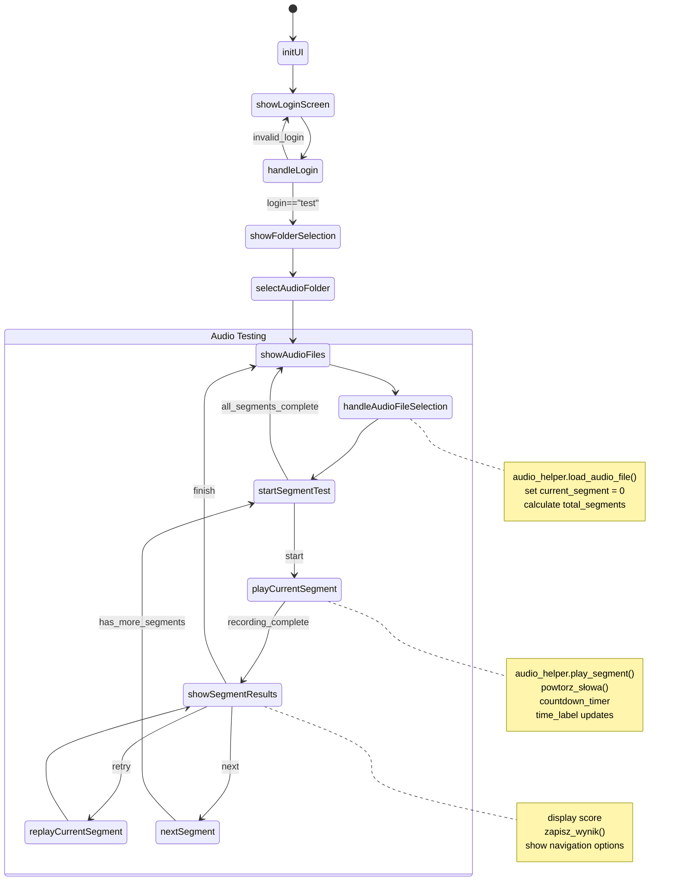

# Projekt UwuBiś

## 1. O projekcie

### Opis
> "słysząc jakiś ciąg słów (np. 5 słów z audiobooka), człowiek z implantem chce sprawdzić, czy wszystko poprawnie zrozumiał. Musi więc zapisać sobie słowa które usłyszał, a następnie porównać z faktycznymi słowami (np. sprawdzając w wersji papierowej książki) i zobaczyć ile słów zrozumiał poprawnie." lic. Przemysław Bańkowski. 

### Wymagania
- Python 3.11
- Biblioteki:
  - `speech_recognition` 3.11.0
  - `sounddevice` 72.1.0
  - `soundfile` 0.12.0
  - `numpy` 2.1.1
  - `pandas` 2.1.1
  - `openpyxl` 3.1.2

Instalacja bibliotek
```sh
pip install speechrecognition sounddevice soundfile numpy pandas openpyxl
```
## Tworzenie wirtualnego środowiska (opcjonalne)
[*DO ZROBIENIA*]

### ~Uruchamianie~
~~Umieść plik audio (np. audio1.wav) w katalogu audio~~

~~Uruchom skrypt~~:
```python
python main_new.py
```
### 0.1 Dokumentacja bibliotek
- [QTPY](https://doc.qt.io/qtforpython-6/overviews/timers.html)
## 0.2 Ogólne wytłumaczenie poszczególnych funkcji. 

1. Losowanie pliku audio: Skrypt losuje plik audio z katalogu.
2. Odtwarzanie pliku audio: Skrypt odtwarza wybrany plik audio, aby użytkownik mógł go usłyszeć.
3. Nagrywanie odpowiedzi użytkownika: Po odtworzeniu pliku audio, skrypt prosi użytkownika o powtórzenie usłyszanych słów i nagrywa jego odpowiedź.
4. Rozpoznawanie mowy: Skrypt używa biblioteki speechrecognition, aby rozpoznać słowa wypowiedziane przez użytkownika.
5. Porównywanie słów: Skrypt porównuje słowa wypowiedziane przez użytkownika z oryginalnymi słowami z pliku audio.
6. Zapisywanie wyników: Skrypt zapisuje wyniki do pliku Excel, w którym znajdują się informacje o poprawnie i niepoprawnie powtórzonych słowach.


### 0.2.1 Schemat Działania funkcji main.py

## 2. Wytłumacznie właściwości kodu, co do czego i po co.
Tutaj tłumacze konkretne funcje bibliotek jak działają, a całe elementy kodu są wytłumaczone dokładniej w [WYTŁUMACZENIE](explaining.md)

### 2.1. `threading`
1. `threading` to standardowy moduł Pythona służący do obsługi wielowątkowości. Pozwala na:
- Równoległe wykonywanie zadań
- Zarządzanie wieloma operacjami jednocześnie
- Poprawę wydajności aplikacji, szczególnie przy operacjach I/O

Przykład użycia:
```python
import threading

def moje_zadanie():
    print("Wykonuję zadanie w osobnym wątku")

# Tworzenie nowego wątku
watek = threading.Thread(target=moje_zadanie)
watek.start()  # Uruchomienie wątku
watek.join()   # Oczekiwanie na zakończenie wątku
```
W kontekście aplikacji audio, threading jest szczególnie przydatny do:

- Odtwarzania dźwięku w tle
- Nagrywania audio bez blokowania interfejsu
- Przetwarzania dźwięku równolegle z innymi operacjami

**Obszerniejszy przykład**

```python
import threading
import time
from playsound import playsound  # dla przykładu

class AudioPlayer:
    def __init__(self):
        self.is_playing = False
        
    def play_audio_file(self, file_path):
        # Funkcja odtwarzająca dźwięk w osobnym wątku
        def play():
            self.is_playing = True
            playsound(file_path)
            self.is_playing = False
            
        # Utworzenie i uruchomienie wątku
        audio_thread = threading.Thread(target=play)
        audio_thread.start()

       
        
    def wait_for_completion(self):
        # Czekamy aż dźwięk się skończy
        while self.is_playing:
            time.sleep(0.1)

# Przykład użycia:
player = AudioPlayer()
player.play_audio_file("sample.mp3")  # Rozpoczyna odtwarzanie w tle
print("Możesz wykonywać inne operacje podczas odtwarzania!")
player.wait_for_completion()  # Poczekaj na zakończenie
```
Najbardziej przykuwa uwagę element 
```python
# Utworzenie i uruchomienie wątku
        audio_thread = threading.Thread(target=play)
        audio_thread.start()
```
Już tłumaczę co to robi i po co, dla wygody rozbiję to na części:
1. `threading.Thread(target=play)`:

- Tworzy nowy obiekt wątku
- `target=play` wskazuje funkcję `play` jako kod do wykonania w tym wątku
- `play` to funkcja zdefiniowana wcześniej (bez nawiasów, bo przekazujemy referencję)

2. `audio_thread.start()`:

- Uruchamia utworzony wątek
- Od tego momentu funkcja play wykonuje się równolegle z głównym programem
- Nie blokuje pozostałej części programu


# n. Posłowie 
Moja wizję rozwoju projektu opisałem w [dalszy rozwoj](dalszy_rozwoj.md). 

## Brudnopis Karol + krzys
AUDIOLIB Class:

`load_audio_file`: Ładuje plik audio i segmentuje go na segmenty po 5 słowach.
`play_segment`: Odtwarza bieżący segment audio.
_`play_segment_audio`: Wewnętrzna metoda do odtwarzania segmentu audio.
`_recognize_words`: Rozpoznaje słowa z pliku audio.
`replay_current_segment`: Powtarza odtwarzanie aktualnego segmentu.
`get_total_segments`: Zwraca całkowitą liczbę segmentów.
`get_current_segment_words`: Zwraca słowa z bieżącego segmentu.
`get_segment_words`: Zwraca słowa dla konkretnego segmentu z macierzy.
`mark_segment_complete`: Oznacza segment jako ukończony i przechowuje wyniki.
`is_segment_complete`: Sprawdza, czy segment jest ukończony.
`_update_current_segment_audio`: Aktualizuje dane audio bieżącego segmentu.


Nazwa pliku: {{main.py}}
Opis: Główny plik aplikacji UwuBiś, odpowiedzialny za interfejs użytkownika i logikę biznesową.
Funkcjonalności:

Logowanie: obsługa logowania użytkowników
Wybór folderu z plikami audio: umożliwia wybór folderu z plikami audio do przetwarzania
Przetwarzanie plików audio: wyświetla listę plików audio, pozwala na odtwarzanie i przetwarzanie wybranych plików
Test słuchu: prowadzi użytkownika przez test słuchu, wyświetla wyniki i zapisuje je w pliku Excel
Klasy i funkcje:

MainWindow: główna klasa aplikacji, dziedzicząca z QMainWindow
__init__: inicjacja okna głównego
initUI: inicjacja interfejsu użytkownika
showLoginScreen, showFolderSelection, showAudioFiles, startSegmentTest, playCurrentSegment, confirmRepetition, showSegmentResults: metody obsługujące poszczególne ekrany aplikacji
Dokumentacja dla library.py

Nazwa pliku: library.py
Opis: Plik biblioteki, zawierający funkcje wspomagające przetwarzanie plików audio i rozpoznawanie mowy.
Funkcjonalności:

Rozpoznawanie mowy: funkcja powtorz_słowa rozpoznaje mowę użytkownika
Przetwarzanie plików audio: klasa AUDIOLIB obsługuje odtwarzanie i przetwarzanie plików audio
Zapis wyników: funkcja zapisz_wynik zapisuje wyniki testu w pliku Excel
Klasy i funkcje:

AUDIOLIB: klasa obsługująca przetwarzanie plików audio
``__init__``: inicjacja obiektu AUDIOLIB
``load_audio_file``, play_segment, replay_current_segment, get_segment_words: metody obsługujące przetwarzanie plików audio
``powtorz_słowa``: funkcja rozpoznająca mowę użytkownika
`zapisz_wynik`: funkcja zapisująca wyniki testu w pliku Excel

**Plan optymalizacji:**

Krótkoterminowe cele (w ciągu 2-4 tygodni):

**Poprawa stabilności aplikacji:**
Usuwanie błędów i obsługa wyjątków w kluczowych funkcjach.
**Optymalizacja wydajności:**
Przegląd i optymalizacja kodu w funkcjach powtorz_słowa i load_audio_file.
**Ulepszona obsługa błędów:**
Wprowadzenie bardziej szczegółowych komunikatów o błędach dla użytkownika.

## **Średnioterminowe cele (w ciągu 4-8 tygodni):**

Rozszerzenie funkcjonalności:
- Dodanie nowych rodzajów testów (np. testy słuchu z obrazkami).

Ulepszona analityka:
- Wprowadzenie systemu śledzenia postępów użytkowników i generowania raportów.

Poprawa interfejsu użytkownika:
- Przeprojektowanie interfejsu, aby był bardziej intuicyjny i przyjazny użytkownikowi.
Długoterminowe cele (w ciągu 2-6 miesięcy):

Integracja z nowymi technologiami:


przykład uzycia 

Wprowadzenie obsługi nowych formatów plików audio lub integracja z innymi aplikacjami.
Rozwijanie funkcjonalności rozpoznawania mowy:
Ulepszona dokładność rozpoznawania mowy, obsługa większej liczby języków.
Tworzenie wersji mobilnej aplikacji:
Przystosowanie aplikacji do urządzeń mobilnych, zachowując wszystkie funkcjonalności.


## przykłady uzycia nvidia//nemo do poprawy rozpoznawania słów:

Użyjemy biblioteki nvidia-nemo do poprawy rozpoznawania słów w segmentach.//
Przykładowa implementacja: 
```python
import torch
from nemo_text_processing society nlp import NLP
from nemo_text_processing society speech_recognition beam_search import BeamSearch
from nemo_text_processing society speech_recognition decoding import Decoding
from nemo_text_processing society speech_recognition praytorch import ASR
from nemo_text_processing society speech_recognition atd import Tokenizer

# Utwórz instancję modelu ASR z `nvidia-nemo`
nemo_model_name = "stt_en_quartznet15x5"
model = ASR(nemo_model_name=nemo_model_name)
tokenizer = Tokenizer(
    model=model,
    tokenizer_name=" SpecTokenizersPreTrainedTokenizer",
    tokenizer_model="nemo-quartznet15x5-sv",
    add tokenize_bos=True,
    add tokenize eos=True,
)

# Modyfikacja metody _recognize_words w twojej klasie AUDIOLIB
def _recognize_words(self, file_path):
    """Recognizes words from audio file using NVIDIA Nemo."""
    try:
        # Load audio file
        audio_data, samplerate = sf.read(file_path)

        # Utwórz instancję dekodera z `nvidia-nemo`
        decoder = BeamSearch(model=model, tokenizer=tokenizer)

        # Wykonaj dekodowanie
        transcription = decoder.transcribe(audio_data, samplerate)

        # Zwróć listę słów z transkrypcji
        return transcription.split()
    except Exception as e:
        logging.error(f"Error recognizing words: {str(e)}")
        return []

# Modyfikacja metody powtorz_słowa
def powtorz_słowa(słowa, timeout=None):
    """Nagrywa i rozpoznaje powtórzone słowa użytkownika używając NVIDIA Nemo."""
    try:
        # Utwórz instancję dekodera z `nvidia-nemo`
        decoder = BeamSearch(model=model, tokenizer=tokenizer)

        # Nagrywa audio
        with sr.Microphone() as source:
            logging.info("Rozpoczęto nagrywanie")
            r.adjust_for_ambient_noise(source)
            # Explicitly set both timeout and phrase_time_limit to the same value
            audio = r.listen(source, timeout=timeout, phrase_time_limit=timeout)

            # Wykonaj dekodowanie
            transcription = decoder.transcribe(audio.get_array(), audio.sample_rate)

            # Zwróć listę słów z transkrypcji
            powtórzone_słowa = transcription.split()
            poprawne_słowa = list(set(słowa) & set(powtórzone_słowa))
            return poprawne_słowa, powtórzone_słowa
    except sr.WaitTimeoutError:
        logging.warning("Przekroczono czas oczekiwania na mowę")
        return [], []
    except sr.UnknownValueError:
        logging.warning("Nie rozpoznano żadnych słów")
        return [], []
    except sr.RequestError as e:
        logging.error(f"Błąd połączenia z serwerem rozpoznawania mowy: {str(e)}")
        return [], []
    except Exception as e:
        logging.error(f"Nieoczekiwany błąd: {str(e)}")
        return [], []
```
Powyższe modyfikacje powinny poprawić rozpoznawanie słów w segmentach używając models nvidia-nemo. Trzeba pamietac o zainstalowaiu nvidia nemo i uzywaniu tego zgodnie z licencją i przeznaczeniem. 
- sprawdzic czy serwery to wytrzymają
- sprawdzić czy licencja pozwala na uzytkowanie tego w ten sposób

Dodatkowo, aby poprawnie rozpoznawać słowa w segmentach, zalecane jest ustawienie poprawnych parametrów dla modelu ASR, takich jak:

    `batch_siz`e: Określa liczbę segmentów do przetworzenia jednocześnie.
    `sequence_length`: Określa maksymalną długość sekwencji danych wejściowych.
    `sample_rate`: Określa częstotliwość próbkowania danych wejściowych.


## wariant **2**
generalnie to samo ale inne lekko podejscie cechujące sie prostrzą składnią  + wymaga wiekszej mocy obliczeniowej. mniej korzystne i ma wpływ na wydajnosc . 


    Install NVIDIA NeMo and its Dependencies:
    Make sure you have NeMo and its dependencies installed. You may need to install additional libraries such as torch and soundfile.
```python
    pip install nemo_toolkit['all']
```
    Setup NeMo Model:
    You will need to load a pre-trained ASR (Automatic Speech Recognition) model from NeMo. NeMo provides models trained on various datasets. For Polish, you may have to find a model fit for that language or consider fine-tuning an existing model.

    Adjust your recognition method to use NeMo:
    Update the _recognize_words method to utilize the NeMo model for speech-to-text conversion rather than Google’s recognizer.

Here is how you might integrate NVIDIA NeMo into your AUDIOLIB class:
```python
import nemo
import nemo.collections.asr as nemo_asr

class AUDIOLIB:

    def __init__(self, config):
        self.config = config
        self.audio_data = None
        self.samplerate = None
        self.words = []
        self.segments = []
        self.segment_words_dict = {}
        self.current_segment = 0
        self.total_segments = 0
        self.current_segment_audio = None
        self.word_matrix = None
        self.segment_status = {}
        self.temp_storage = {}
        
        # Initialize NeMo ASR model
        self.asr_model = nemo_asr.models.EncDecCTCModel.from_pretrained(model_name="QuartzNet15x5Base-EN")

    def _recognize_words(self, file_path):
        """Recognizes words from audio file using NeMo ASR."""
        try:
            # Predict words using NeMo
            transcription = self.asr_model.transcribe(paths2audio_files=[file_path])
            if transcription:
                text = transcription[0]
                return text.split()  # Split into words
            return []

        except Exception as e:
            logging.error(f"Error recognizing words with NeMo: {str(e)}")
            return []

# Implement similar NeMo integration for powtorz_słowa
import soundfile as sf
def powtorz_słowa(słowa, timeout=None):
    """Nagrywa i rozpoznaje powtórzone słowa użytkownika."""
    try:
        # This part of the code should handle the audio recording functionality
        with sr.Microphone() as source:
            logging.info("Rozpoczęto nagrywanie")
            r.adjust_for_ambient_noise(source)
            audio = r.listen(source, timeout=timeout, phrase_time_limit=timeout)
        
            # Save to a temporary wave file for NeMo processing
            with open("temp_repeated.wav", "wb") as f:
                f.write(audio.get_wav_data())

        # Transcribe using NeMo
        repeated_transcription = self.asr_model.transcribe(paths2audio_files=["temp_repeated.wav"])
        powtórzone_słowa = repeated_transcription[0].split() if repeated_transcription else []
        poprawne_słowa = list(set(słowa) & set(powtórzone_słowa))
        return poprawne_słowa, powtórzone_słowa
    except Exception as e:
        logging.error(f"Nieoczekiwany błąd: {str(e)}")
        return [], []
```
Integration Notes:

    Model Selection: Make sure you select an appropriate model for your language. If there isn't a model trained specifically for Polish, consider fine-tuning an English model with a Polish dataset.
    Audio Data Handling: Ensure NeMo receives correctly formatted audio inputs. This involves saving your live audio captures into files before sending them to NeMo for processing.

## Problemy:
- Znalezienie modelu dobrze rozumującego jezyk polski,
- znalezienie finansowania na serwery (opcjonalne bo nie jest sprawdzona obecna wydajnosc)
- sprawdzenie ceny API, koszty uzytkownaia, + wpływu na jakosć znajdowania słów i poprawę działania programu. 
    Dependencies and Environment: Validate that your environment has all necessary NeMo dependencies. Consider running it on an environment with NVIDIA GPUs for efficient processing.
    Expand the _recognize_words Method: Similar changes can be applied to the powtorz_słowa function for recognizing repeated words.

By implementing these changes, your application should benefit from more precise ASR capabilities, helping users with accurate repetitions of words and handling segments efficiently.
